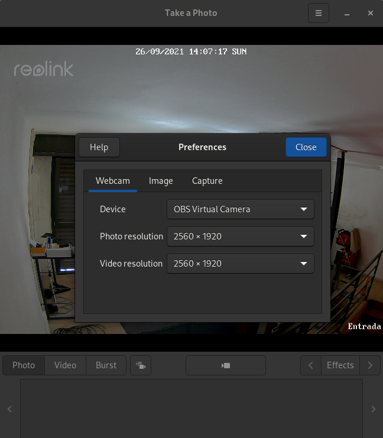

# Stream Reolink with HKCam

This will convert your Reolink RTSP camera into a HomeKit Secure Video cameara.

## Tested hardware/distro

Distro: Fedora 34

Camera tested: Reolink RLC-511

## Requirements

Build and install hkcam: https://github.com/brutella/hkcam

Install v4l2loopback from https://copr.fedorainfracloud.org/coprs/sentry/v4l2loopback.

Install required GStreamer plugins:

```
dnf install gstreamer1-plugins-base-tools gstreamer1-doc gstreamer1-plugins-good gstreamer1-plugins-good-extras gstreamer1-plugins-ugly gstreamer1-plugins-bad-free gstreamer1-plugins-bad-free-extras gstreamer1-libav.x86_64
```

Create the video device:

```
sudo modprobe v4l2loopback video_nr=10
```

Create the video sink:

```
gst-launch-1.0 -v rtspsrc location=rtsp://<Reolink-IP>/h264Preview_01_main latency=100 ! queue ! rtph264depay ! h264parse ! avdec_h264 ! videoconvert ! v4l2sink device=/dev/video10
```

At this point, you should be able to use a program like [Cheese](https://www.google.com/search?client=firefox-b-d&q=cheese+gnome) to view the Reolink video feed:



## Run hkcam

Run `hkcam`:

```
hkcam -loopback_filename /dev/video10
```

You should be able to add the camera via Home app now.
